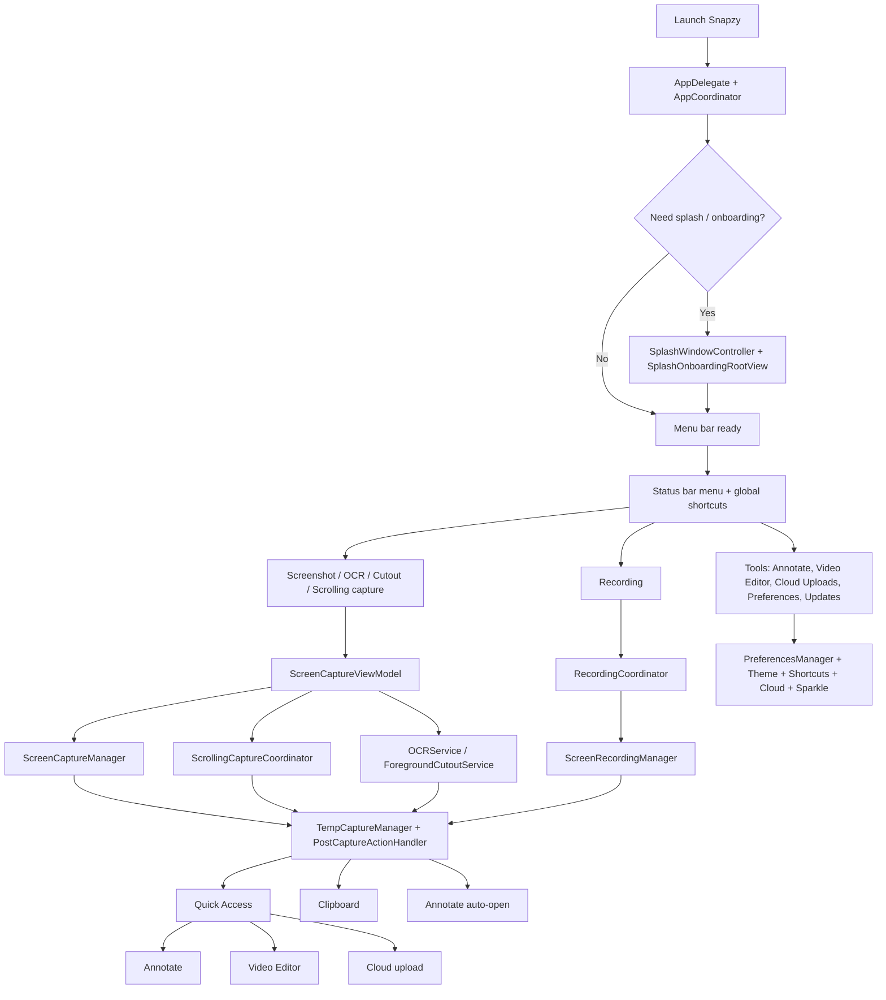

# Documentation Map

Flow-first entrypoint for humans and agents working in Snapzy. Docs are separated by domain and cross-linked; start here, then jump to the doc that owns your topic.

## Read First

| Doc | Why it exists | Read when |
| --- | --- | --- |
| [`../README.md`](../README.md) | Public product summary, install, feature list | Any new session |
| [`DEVELOPMENT.md`](DEVELOPMENT.md) | First-time local setup and source-based development | Running from source |
| [`STRUCTURE.md`](STRUCTURE.md) | Real source-tree map, runtime architecture, persistence, test architecture, edit guide | Any code change |

## Architecture & Platform

| Doc | Covers |
| --- | --- |
| [`APP_LIFECYCLE.md`](APP_LIFECYCLE.md) | Launch sequence, onboarding, menu bar, app identity, theme, migrations, entitlements |
| [`PREFERENCES.md`](PREFERENCES.md) | Settings tabs reference, after-capture matrix, preferences storage pattern |
| [`SHORTCUTS.md`](SHORTCUTS.md) | Global/overlay/annotate shortcuts, conflict detection, `snapzy://` URL scheme |
| [`UPDATES.md`](UPDATES.md) | Sparkle updates and channels, diagnostics logging, problem reporting |
| [`LOCALIZATION.md`](LOCALIZATION.md) | Localization architecture, catalog ownership, verification |
| [`CONFIGURATION.md`](CONFIGURATION.md) | TOML export/import schema, sync, security boundaries |

## Capture & Recording

| Doc | Covers |
| --- | --- |
| [`CAPTURE.md`](CAPTURE.md) | Screenshot modes, selection overlay, OCR/QR, object cutout, Smart Element |
| [`SCROLLING_CAPTURE.md`](SCROLLING_CAPTURE.md) | Long-screenshot stitching subsystem |
| [`RECORDING.md`](RECORDING.md) | Screen recording, audio, overlays, GIF output, Smart Camera metadata |
| [`POST_CAPTURE.md`](POST_CAPTURE.md) | After-capture action matrix, temp vs export destinations, formats, clipboard |

## Editors & Post-Capture UX

| Doc | Covers |
| --- | --- |
| [`QUICK_ACCESS.md`](QUICK_ACCESS.md) | Floating post-capture panel, card actions, gestures, pin windows |
| [`HISTORY.md`](HISTORY.md) | Capture history panel, restore flow, GRDB storage, retention |
| [`ANNOTATE.md`](ANNOTATE.md) | Annotation editor, tools, mockups, redaction, session sidecars, inline Capture Markup |
| [`VIDEO_EDITOR.md`](VIDEO_EDITOR.md) | Trim, zoom segments, Follow Mouse, speed, backgrounds, export, GIF |
| [`CLOUD.md`](CLOUD.md) | S3/R2/Google Drive uploads, credentials, uploads window, history |

## Build & Release

| Doc | Covers |
| --- | --- |
| [`BUILD.md`](BUILD.md) | Archive, export, and DMG packaging commands |
| [`RELEASES.md`](RELEASES.md) | Release and appcast workflow |
| [`UPDATE_TESTING.md`](UPDATE_TESTING.md) | Local Sparkle update test harness |
| [`SELF_SIGNED_CERT.md`](SELF_SIGNED_CERT.md) | Local signing setup |

## Product Flow Map

## Agent Reading Order

- Screenshot capture, selection overlay, OCR, cutout, smart element: `STRUCTURE.md` → `CAPTURE.md`
- Scrolling capture: `CAPTURE.md` → `SCROLLING_CAPTURE.md`
- Recording, GIF, Smart Camera: `CAPTURE.md` → `RECORDING.md` → `VIDEO_EDITOR.md`
- Post-capture actions, temp files, formats: `POST_CAPTURE.md` → `QUICK_ACCESS.md`
- Capture history, retention, restore: `HISTORY.md` → `ANNOTATE.md` (sidecar section)
- Annotate editor, inline markup: `ANNOTATE.md`; video editor: `VIDEO_EDITOR.md`
- Onboarding, menu bar, startup, entitlements: `APP_LIFECYCLE.md`
- Preferences UI or the after-capture matrix: `PREFERENCES.md`
- Shortcuts or `snapzy://` automation: `SHORTCUTS.md`
- Cloud storage and upload UX: `CLOUD.md`
- TOML config export/import: `CONFIGURATION.md` (+ `APP_LIFECYCLE.md` onboarding grant)
- Updates, diagnostics, problem reports: `UPDATES.md`
- Tests: `STRUCTURE.md` → `DEVELOPMENT.md`
- Localization or user-facing copy: `LOCALIZATION.md` → the feature doc for the affected flow
- Build, release, updater: `DEVELOPMENT.md` → `BUILD.md` → `RELEASES.md` → `UPDATE_TESTING.md`

## Current Behavior Notes

- `AfterCaptureAction.save` decides whether captures go straight to the export folder or into `~/Library/Application Support/Snapzy/Captures/` as temp files. Details in `POST_CAPTURE.md`.
- Cloud upload is **manual-only** since commit `dd4ccd5` removed the after-capture auto-upload preference. Manual entry points: Quick Access card, Annotate (`⌘U`), Video Editor, History — enabled via the `uploadToCloud` Quick Access action (Preferences → Quick Access → Quick Actions) and gated on `CloudManager.isConfigured`. Details in `CLOUD.md`.
- GIF recording flow first creates a video, inserts it into Quick Access, converts it, then swaps the card to the GIF output. Details in `RECORDING.md`.
- Quick Access cards can be dismissed with the visible dismiss action, mouse swipe, or an optional two-finger horizontal swipe on the preview card. Details in `QUICK_ACCESS.md`.
- Annotate and Video Editor temporarily elevate Snapzy from accessory mode to regular app mode so the editor windows appear in Dock and Cmd+Tab.
- Screenshot annotations that have been committed are persisted as sidecar packages in `Application Support/Snapzy/AnnotationSessions/`, so History restore can reopen editable annotations instead of only the flattened image. Details in `ANNOTATE.md` and `HISTORY.md`.
- Full Annotate drag-to-app closes the editor by default. Settings → Annotate → `Close after drop` can be turned off to keep the editor session alive after sharing a rendered copy; `Reactivate after drop` controls whether that preserved editor is activated after drop.
- During recording, the menu bar item stays menu-first instead of left-click-to-stop. It shows the live timer, keeps Preferences reachable, and temporarily excludes the Settings window from own-app recordings when needed. Details in `RECORDING.md`.
- URL Scheme automation triggers via `snapzy://` deep links can be disabled under Settings → Advanced → URL Scheme integration (enabled by default). When disabled, incoming automation requests are logged and ignored. Full route table in `SHORTCUTS.md`.
- Settings → Advanced exports and imports portable TOML preferences at `~/.config/snapzy/config.toml`; folder access is granted once (onboarding config step or Settings → Advanced), background sync is debounced and signature-guarded, and valid direct edits apply on next launch. Details in `CONFIGURATION.md`.

If one of these behaviors changes, update this file, the owning feature doc, [`STRUCTURE.md`](STRUCTURE.md), and the root [`README.md`](../README.md) in the same change.
